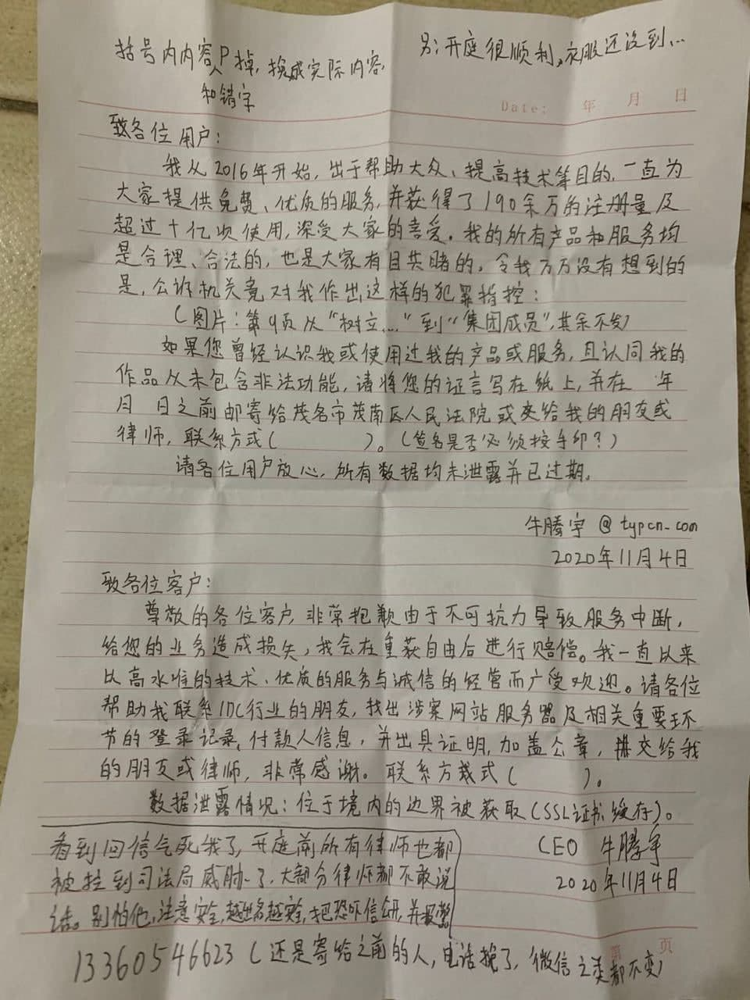

# 至各位用户、客户的信以及个人情况声明

尊敬的用户们：

>你们好。
>
>本人于 2016 年开始，出于帮助大众、提高技术水平等目的，一直为大家提供免费、优质的服务，并获得了 190 余万的注册量以及超过十亿次的使用，深受大家喜爱。我的所有产品和服务均是合理、合法的，也是大家有目共睹的。令我万万没有想到的是，公诉机关竟然对本人作出了各种不实的犯罪指控。
>
>如果您曾经认识我或使用过我的产品或服务，且认为我的作品从未包含非法功能，请将我的情况传达出去，并在尽可能的情况下替我伸冤。十分感谢你们的理解与协助。谢谢。

尊敬的客户们：

>你们好。
>
>非常抱歉由于不可抗力导致服务中断将近一年半的时间，给您的业务带来了巨大的损失，我保证我会在重获自由后尽快进行赔偿。我一直以来以我高水准的技术、优质的服务和诚信的经营而广受欢迎。
>
>请各位帮助我联系 IDC 行业的朋友，找出涉案网站服务器及相关重要环节的登陆记录、付款人信息，并出具证明、加盖公章，提交给我的朋友或律师，非常感谢。我的律师的联系方式为：tiansheng500864，十分感谢你们的支持和理解。
>
>另附数据泄露情况：位于境内的边界被获取（ SSL 证书，缓存）。

另在此声明：

>本人于 2020 年 1 月左右，被迫在数百页的 A4 纸上写下数十万字的“自述材料”，这些内容均是被公安指定的。本人被强迫按其要求虚构、编造许多不存在、刻意伪造的所谓“事实”。本人必须按照要求的标题、提纲，在规定的时间内写够足够的页数，否则只能吃白饭、禁止睡觉、吊起殴打等。
>
>在 2019 年 12 月 10 日到 2020 年 1 月 20 日期间，本人只有三十小时的睡眠时间，且被殴打致残，一只手臂已经无法动弹。
>
>故本人在此声明：这些文件都是按照办案人员要求被迫编造的，不代表本人意见，也并不属实。

CEO 牛腾宇

2020年11月4日
